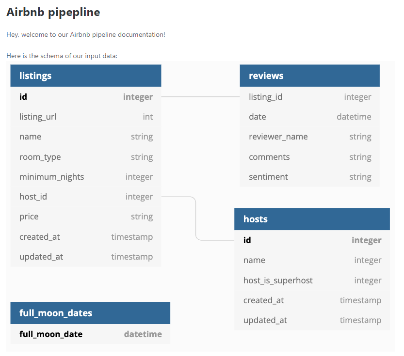
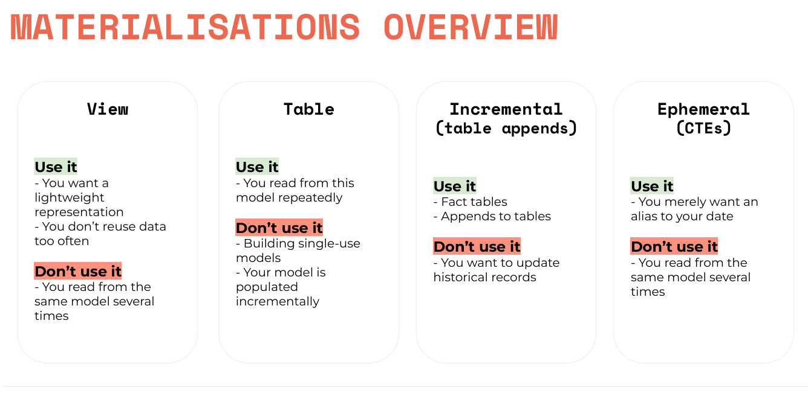
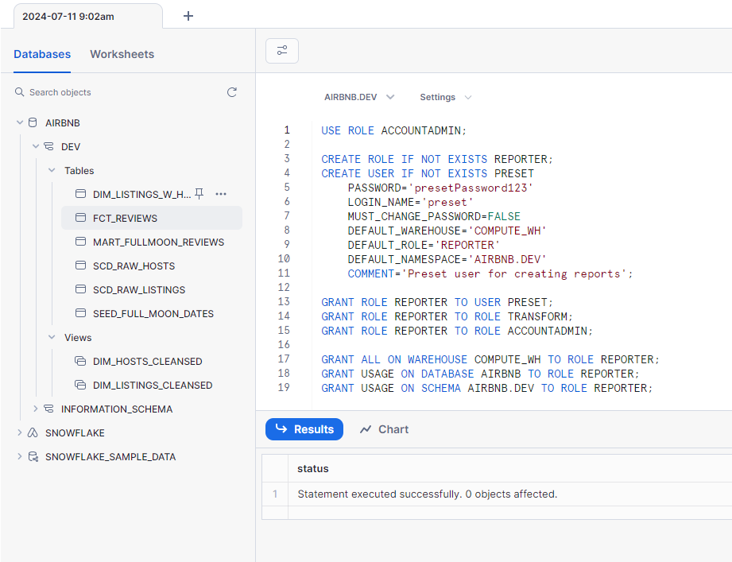
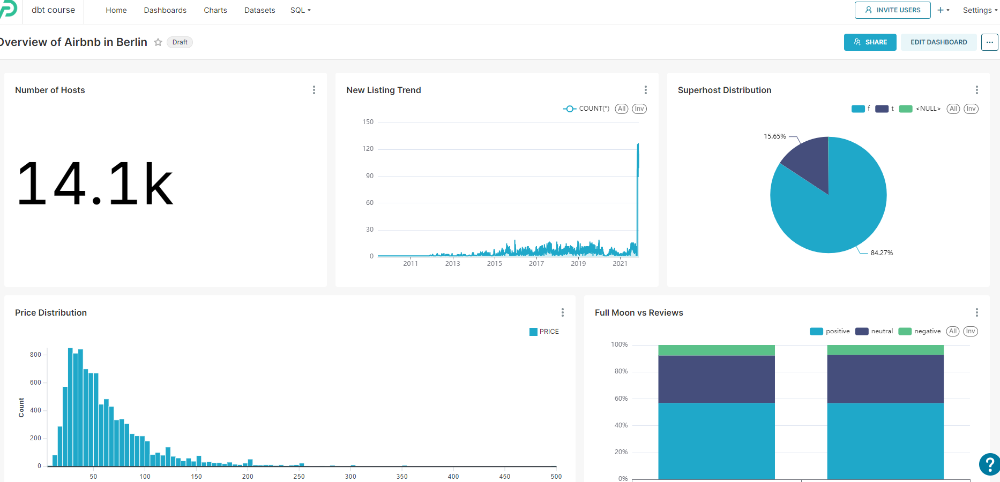
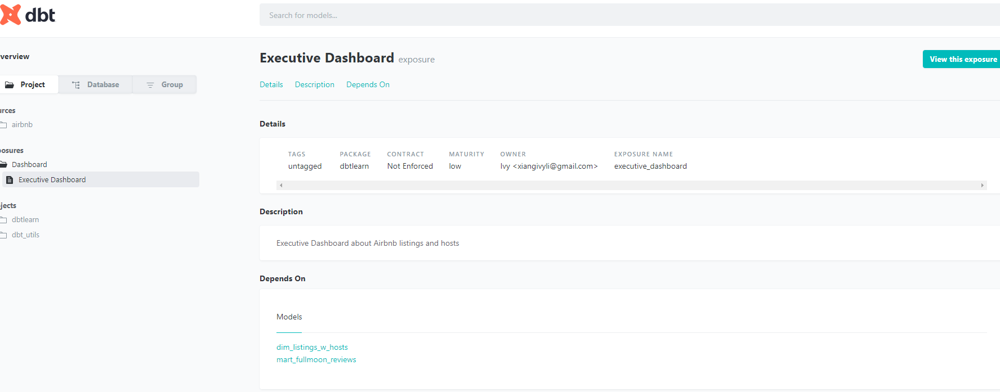
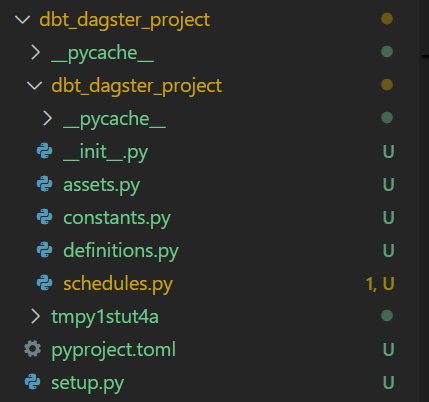
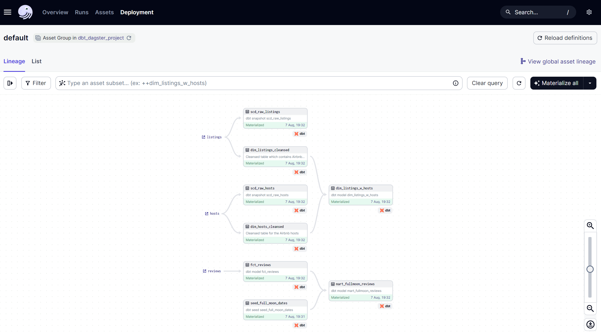

# Table of Contents
1. [Technology](#1-technology)
2. [Summary of the model](#2-summary-of-the-model)
3. [Requirements for the analytics engineering](#3-requirements-for-the-analytics-engineering)
4. [Snowflake Settings](#4-snowflake-settings)
    - 4.1 [Features of Snowflake](#41-features-of-snowflake)
    - 4.2 [Environment Setup](#42-environment-setup)
    - 4.3 [Import data](#43-import-data)
5. [Python and Python virtual environment](#5-python-and-python-virtual-environment)
6. [dbt Installation](#6-dbt-installation)
7. [Dataflow](#7-data-flow-overview)
8. [Materialisation](#8-materialisations-overview)
9. [dbt Commands](#7-dbt-commands)
10. [Analyse](#10-analyse)
11. [Hooks](#11-prehook-and-posthook)
12. [Result in Snowflake](#12-result-in-snowflake)
13. [Data Visualisation and Exposure](#13-data-visualisation-and-exposure)
14. [Great Expectations](#14-great-expectations)
15. [Logging](#15-logging)
16. [Variables](16-variables)
17. [Orchestration](17-orchestration)
      - 17.1 [Folder Structure of Dagster](#171-the-structure-of-the-folder)
      - 17.2 [UI of Dagster](#172-ui-of-dagster)


# 1. Technology
 - Python 3.10.13
 - Environment: Codespaces
 - Data warehouse: Snowflake
 - Data transformation: dbt
 - BI tool: Preset
 - Data Quality: Great Expectation

# 2. Summary of the model
Data Source: Airbnb data in Berlin
Tables: hosts, listings, reviews



Seeds: Full moon date

Purpose: Understand if the review is related to the full moon date

# 3. Requirements for the analytics engineering
- Modeling changes are easy to follow and revert
- Explicit dependencies between models
- Explore dependencies between models
- Data quality tests
- Error reporting
- Incremental load of fact tables
- Track history of dimension tables
- Easy-to-access documentation

# 4. Snowflake Settings
## 4.1 Features of Snowflake
- Each worksheet has a context, that consists of Role, Warehouse, Database & Schema
- Create user with password, then grant ROLE with its privileges to this user

## 4.2 Environment Setup
```sql
-- Use an admin role
USE ROLE ACCOUNTADMIN;

-- Create the `transform` role
CREATE ROLE IF NOT EXISTS transform;
GRANT ROLE TRANSFORM TO ROLE ACCOUNTADMIN;

-- Create the default warehouse if necessary
CREATE WAREHOUSE IF NOT EXISTS COMPUTE_WH;
GRANT OPERATE ON WAREHOUSE COMPUTE_WH TO ROLE TRANSFORM;

-- Create the `dbt` user and assign to role
CREATE USER IF NOT EXISTS dbt
  PASSWORD='dbtPassword123'
  LOGIN_NAME='dbt'
  MUST_CHANGE_PASSWORD=FALSE
  DEFAULT_WAREHOUSE='COMPUTE_WH'
  DEFAULT_ROLE='transform'
  DEFAULT_NAMESPACE='AIRBNB.RAW'
  COMMENT='DBT user used for data transformation';
GRANT ROLE transform to USER dbt;

-- Create our database and schemas
CREATE DATABASE IF NOT EXISTS AIRBNB;
CREATE SCHEMA IF NOT EXISTS AIRBNB.RAW;

-- Set up permissions to role `transform`
GRANT ALL ON WAREHOUSE COMPUTE_WH TO ROLE transform; 
GRANT ALL ON DATABASE AIRBNB to ROLE transform;
GRANT ALL ON ALL SCHEMAS IN DATABASE AIRBNB to ROLE transform;
GRANT ALL ON FUTURE SCHEMAS IN DATABASE AIRBNB to ROLE transform;
GRANT ALL ON ALL TABLES IN SCHEMA AIRBNB.RAW to ROLE transform;
GRANT ALL ON FUTURE TABLES IN SCHEMA AIRBNB.RAW to ROLE transform;
```
## 4.3 Import data
```sql
-- Set up the defaults
USE WAREHOUSE COMPUTE_WH;
USE DATABASE airbnb;
USE SCHEMA RAW;

-- Create our three tables and import the data from S3
CREATE OR REPLACE TABLE raw_listings
                    (id integer,
                     listing_url string,
                     name string,
                     room_type string,
                     minimum_nights integer,
                     host_id integer,
                     price string,
                     created_at datetime,
                     updated_at datetime);
                    
COPY INTO raw_listings (id,
                        listing_url,
                        name,
                        room_type,
                        minimum_nights,
                        host_id,
                        price,
                        created_at,
                        updated_at)
                   from 's3://dbtlearn/listings.csv'
                    FILE_FORMAT = (type = 'CSV' skip_header = 1
                    FIELD_OPTIONALLY_ENCLOSED_BY = '"');
                    

CREATE OR REPLACE TABLE raw_reviews
                    (listing_id integer,
                     date datetime,
                     reviewer_name string,
                     comments string,
                     sentiment string);
                    
COPY INTO raw_reviews (listing_id, date, reviewer_name, comments, sentiment)
                   from 's3://dbtlearn/reviews.csv'
                    FILE_FORMAT = (type = 'CSV' skip_header = 1
                    FIELD_OPTIONALLY_ENCLOSED_BY = '"');
                    

CREATE OR REPLACE TABLE raw_hosts
                    (id integer,
                     name string,
                     is_superhost string,
                     created_at datetime,
                     updated_at datetime);
                    
COPY INTO raw_hosts (id, name, is_superhost, created_at, updated_at)
                   from 's3://dbtlearn/hosts.csv'
                    FILE_FORMAT = (type = 'CSV' skip_header = 1
                    FIELD_OPTIONALLY_ENCLOSED_BY = '"');

```
# 5. Python and Python virtual environment
Python 3.12 is not compatible with dbt, here I installed Python 3.10.7
```bash
# Install virtualenv
pip install virtualenv
```

```bash
# Create a Python virtual environment
virtualenv venv
```
```bash
# Activate it
source venv/bin/activate
```

# 6. dbt installation
```bash
pip install dbt-snowflake==1.7.1
```
## dbt setting
Step 1 Have a dbt folder in the home folder
```bash
mkdir -p ~/.dbt
```
Step 2 Init a project
```bash
dbt init dbtlearn
```
# 7. Data Flow Overview


# 8. Materialisations Overview


# 9. dbt Commands
### 9.1 Check connection
```bash
dbt debug
```
### 9.2 Compile and Execute models
```bash
dbt run 
```
### Select specific model
```bash
dbt run --select <model>
```
#### For incremental models
```bash
dbt run --full-refresh
```

### 9.3 Validate without actually execution
```bash
dbt compile
```
### 9.4 Check freshness of source, restrictions are in the sources.yml file
```bash
dbt source freshness
```
### 9.5.1 Populate seed file into snowflake
```bash
dbt seed
```
### 9.5.2 Add snapshot tables or check changes, SCD type2
```bash
dbt snapshot
```
### 9.6 dbt test
```bash
dbt test
```
#### Test related tests with the model
```bash
dbt test --select <model>
```

### 9.7 Install Packages from dbt-Package hub
```bash
dbt deps
```
### 9.8 Generate a json file for documentation
```bash
dbt docs generate
```
### 9.9 Check the doc from http server
```bash
dbt docs serve
```

# 10. Analyse

Add a model in the `analyses` folder to store the analyse query for analysis without materialiation.


# 11. Prehook and posthook

To set the working database and grant permission to role
```yml
models:
  dbtlearn:
    +pre-hook: 
      - "use warehouse COMPUTE_WH"
    +post-hook:
      - "GRANT SELECT ON {{ this }} TO ROLE REPORTER"
```

# 12. Result in Snowflake

You will see the populated seed file and snapshot files, and transformed data in the snowflake
Meanwhile, I added a reporter role for the next data visualisation.



# 13. Data Visualisation and Exposure

I connected the snowflake dataset and Preset, and drawn the overview of the business



**Exposure** added a yml file in the model and can be added in the documentation.



# 14. Great Expectations 

### Step 1: Install Packages `calogica/dbt_expectations`

## Option 1, Test the output

### Step 2: Add tests in the `schema.yml`

### Step 3: `dbt test --select <model name>

## Option 2, Test the source

### Step 2: Add tests in the `sources.yml`

### Step 3: `dbt test --select source:airbnb.listings`

**Reference**: https://github.com/calogica/dbt-expectations

Popular tests:

- Range of values
- Outlier
- Column Type
- Discount Values keep the same 
- Regex validates the format of the content

### Step 4: `dbt --debug test --select source:airbnb.listings`


# 15. Logging

### Step 1: Create a macros file including `{{ log(" ") }}`
### Step 2: Execute `dbt run-operation <macro name>`
### Step 3: The information is in the logs/dbt.log

What if push it to screen
adding `info=True` after the `{{ log(" ") }}`

What if disable log messages
using `{# log(" ", info=True) #}`

# 16. Variables

## Jinja Variables
Demo
```sql


    
    {{ log("Hello " ~ your_name_jinja, info=True) }}


```
## dbt specific Variables / Project Variables
Demo
```sql


    {{ log("Hello dbt user " ~ var("user_name") ~ " ^^", info=True) }}


```
And then add value to `user_name` in command line ` dbt run-operation demo_variables --vars '{user_name: Ivy}'`

## Set Default Values
### Option 1, setting default values in the macros

`var("user_name", "No Username is set")`

### Option 2, `dbt_project.yml` file

```yml
vars:
  user_name: default_user_name_for_the_demo
```

Understand the level of overwriting for the value : **command line > dbt_project.yml > macros**


# 17. Orchestration

Required packages: 

- dagster-dbt
- dagster-webserver

While the `dbtlearn` is ready for the dbt project, then
Create a project with command line: `dagster-dbt project scaffold --project-name dbt_dagster_project --dbt-project-dir=dbtlearn`

And then
```bash
cd '/workspaces/the_dbt_bootcamp/course/dbt_dagster_project'                                                                                         
DAGSTER_DBT_PARSE_PROJECT_ON_LOAD=1 dagster dev
 ```

 ## 17.1 The structure of the folder

 

 ## 17.2 UI of dagster

 