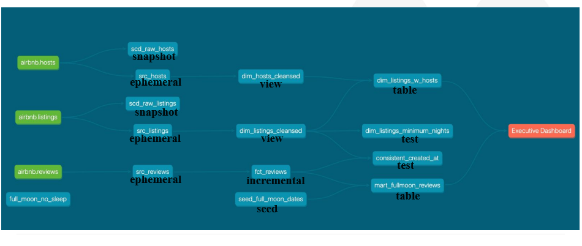

# Technology
 - Python 3.10.13
 - Environment: Codespaces
 - Data warehouse: Snowflake
 - Data transformation: dbt
 - BI tool: Preset

# Requirements
- Modeling changes are easy to follow and revert
- Explicit dependencies between models
- Explore dependencies between models
- Data quality tests
- Error reporting
- Incremental load of fact tables
- Track history of dimension tables
- Easy-to-access documentation

# Snowflake Settings
## Features of Snowflake
- Each worksheet has a context, that consists of Role, Warehouse, Database & Schema

## Environment Setup
```sql
-- Use an admin role
USE ROLE ACCOUNTADMIN;

-- Create warehouse
CREATE WAREHOUSE IF NOT EXISTS dbt_wh with warehouse_size='x-small';

-- Create database and schemas
CREATE DATABASE IF NOT EXISTS AIRBNB;
CREATE SCHEMA IF NOT EXISTS AIRBNB.RAW;

-- Create the role
CREATE ROLE IF NOT EXISTS dbt_role;
GRANT ROLE dbt_role TO ROLE ACCOUNTADMIN;

-- Create the user
CREATE USER IF NOT EXISTS ivy
  PASSWORD='dbtPassword123'
  LOGIN_NAME='ivy'
  MUST_CHANGE_PASSWORD=FALSE
  DEFAULT_WAREHOUSE='DBT_WH'
  DEFAULT_ROLE='dbt_role'
  COMMENT='DBT user used for data transformation';

-- Grant privileges 
GRANT ROLE dbt_role TO USER ivy;
GRANT USAGE ON WAREHOUSE DBT_WH TO ROLE dbt_role;
GRANT ALL ON DATABASE AIRBNB TO ROLE dbt_role;
GRANT ALL ON ALL SCHEMAS IN DATABASE AIRBNB TO ROLE dbt_role;
```
```
## Import data
```sql
-- Set up the defaults
USE WAREHOUSE COMPUTE_WH;
USE DATABASE airbnb;
USE SCHEMA RAW;

-- Create our three tables and import the data from S3
CREATE OR REPLACE TABLE raw_listings
                    (id integer,
                     listing_url string,
                     name string,
                     room_type string,
                     minimum_nights integer,
                     host_id integer,
                     price string,
                     created_at datetime,
                     updated_at datetime);
                    
COPY INTO raw_listings (id,
                        listing_url,
                        name,
                        room_type,
                        minimum_nights,
                        host_id,
                        price,
                        created_at,
                        updated_at)
                   from 's3://dbtlearn/listings.csv'
                    FILE_FORMAT = (type = 'CSV' skip_header = 1
                    FIELD_OPTIONALLY_ENCLOSED_BY = '"');
                    

CREATE OR REPLACE TABLE raw_reviews
                    (listing_id integer,
                     date datetime,
                     reviewer_name string,
                     comments string,
                     sentiment string);
                    
COPY INTO raw_reviews (listing_id, date, reviewer_name, comments, sentiment)
                   from 's3://dbtlearn/reviews.csv'
                    FILE_FORMAT = (type = 'CSV' skip_header = 1
                    FIELD_OPTIONALLY_ENCLOSED_BY = '"');
                    

CREATE OR REPLACE TABLE raw_hosts
                    (id integer,
                     name string,
                     is_superhost string,
                     created_at datetime,
                     updated_at datetime);
                    
COPY INTO raw_hosts (id, name, is_superhost, created_at, updated_at)
                   from 's3://dbtlearn/hosts.csv'
                    FILE_FORMAT = (type = 'CSV' skip_header = 1
                    FIELD_OPTIONALLY_ENCLOSED_BY = '"');

```
# Python and Python virtual environment
Python 3.12 is not compatible with dbt, here I installed Python 3.10.7
```bash
# Install virtualenv
pip install virtualenv
```

```bash
# Create a Python virtual environment
virtualenv venv
```
```bash
# Activate it
source venv/bin/activate
```

# dbt installation
```bash
pip install dbt-snowflake==1.7.1
```
## dbt setting
Step 1 Have a dbt folder in the home folder
```bash
mkdir -p ~/.dbt
```
Step 2 Init a project
```bash
dbt init dbtlearn
```
# Data Flow Overview


# Materialisations Overview


# dbt Commands
### Check connection
```bash
dbt debug
```
### Compile and Execute models
```bash
dbt run 
```
### Select specific model
```bash
dbt run --select <model>
```
#### For incremental models
```bash
dbt run --full-refresh
```

### Validate without actually execution
```bash
dbt compile
```
### Check freshness of source, restrictions are in the sources.yml file
```bash
dbt source freshness
```
### Add snapshot tables or check changes
```bash
dbt snapshot
```